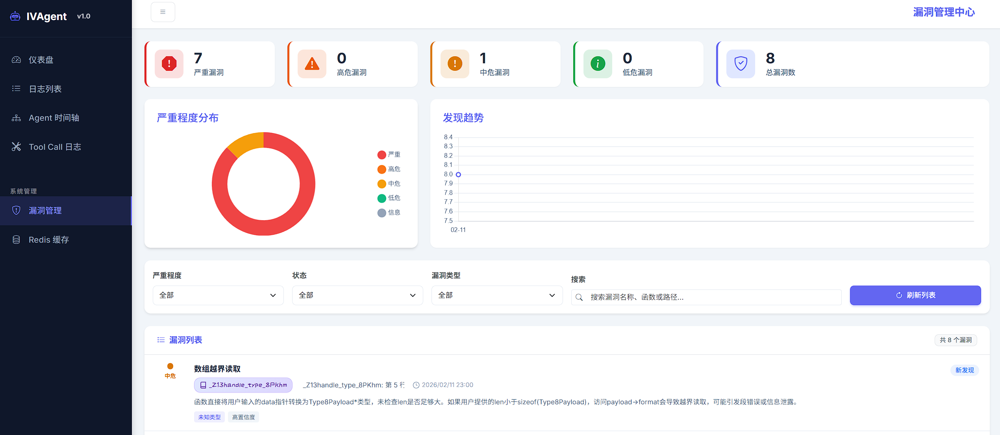
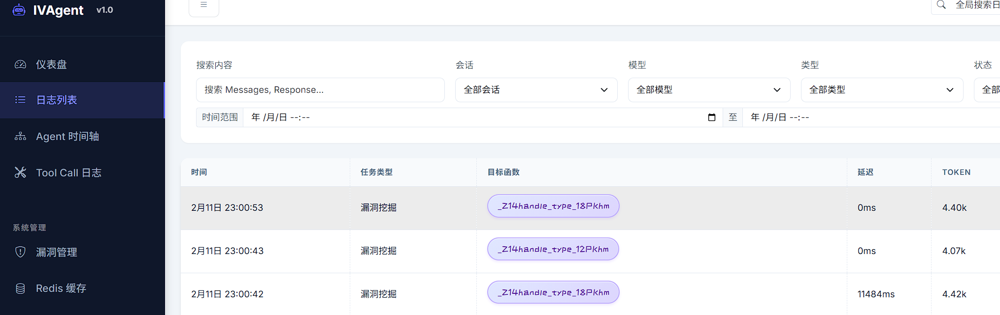
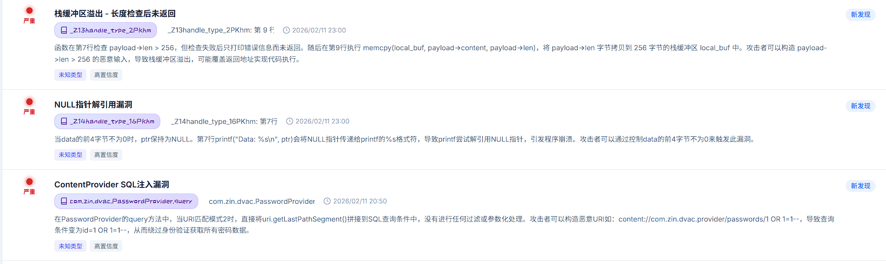

# IVAgent - 智能漏洞挖掘系统

[](https://www.python.org/downloads/)

IVAgent (Intelligent Vulnerability Analysis Agent) 是一个基于大语言模型(LLM)的智能漏洞挖掘系统，支持多种分析引擎和二进制/源码分析场景。




## 目录

- [核心特性](#核心特性)
- [系统架构](#系统架构)
- [快速开始](#快速开始)
- [使用方式](#使用方式)
- [核心概念](#核心概念)
- [配置说明](#配置说明)
- [扩展开发](#扩展开发)

---

## 核心特性

- **多引擎支持**: IDA Pro (二进制)、JEB (Android)、ABC-Decompiler (HarmonyOS)、Source Code (源码)
- **递归深度分析**: 基于调用链的深度漏洞挖掘，支持跨函数分析
- **约束传播**: 支持污点源追踪和参数约束在调用链中的传播
- **智能调度**: LLM 驱动的 Workflow 编排和任务调度
- **可视化**: 完整的 Web 界面支持日志追踪、漏洞管理和 Agent 执行可视化

---

## 系统架构

IVAgent 采用**分层设计**，核心组件包括：

```
┌─────────────────────────────────────────────────────┐
│                 用户界面层                           │
│  (CLI / Web UI / API)                               │
├─────────────────────────────────────────────────────┤
│                 编排调度层                           │
│  (Orchestrator / Task Manager / Workflow Parser)    │
├─────────────────────────────────────────────────────┤
│                 智能分析层                           │
│  (DeepVulnAgent / FunctionSummaryAgent / ...)       │
├─────────────────────────────────────────────────────┤
│                 引擎抽象层                           │
│  (IDA Engine / JEB Engine / Source Engine / ...)    │
├─────────────────────────────────────────────────────┤
│                 数据存储层                           │
│  (Vuln Storage / Log Storage / Cache)               │
└─────────────────────────────────────────────────────┘
```

### 项目结构

```
ivas/
├── ivagent/                    # 核心包
│   ├── agents/                 # Agent 实现
│   │   ├── deep_vuln_agent.py  # 深度漏洞挖掘 Agent (核心)
│   │   ├── callsite_agent.py   # 调用点解析 Agent
│   │   ├── function_summary_agent.py  # 函数摘要 Agent
│   │   └── prompts.py          # 提示词模板
│   ├── backends/               # 后端适配器
│   │   ├── ida/                # IDA Pro 适配器
│   │   ├── jeb/                # JEB 适配器
│   │   └── abc_decompiler/     # ABC 反编译器适配器
│   ├── core/                   # 核心组件
│   │   ├── llm_logger.py       # LLM 调用日志
│   │   ├── agent_logger.py     # Agent 执行日志
│   │   ├── vuln_storage.py     # 漏洞存储
│   │   └── tool_llm_client.py  # Tool Call 客户端
│   ├── engines/                # 分析引擎
│   │   ├── base_static_analysis_engine.py  # 引擎基类
│   │   ├── ida_engine.py       # IDA 引擎
│   │   ├── jeb_engine.py       # JEB 引擎
│   │   ├── abc_engine.py       # ABC 引擎
│   │   ├── source_code_engine.py  # 源码引擎
│   │   └── factory.py          # 引擎工厂
│   ├── models/                 # 数据模型
│   │   ├── constraints.py      # 约束和上下文
│   │   ├── vulnerability.py    # 漏洞模型
│   │   └── workflow.py         # Workflow 模型
│   ├── orchestrator/           # 任务编排
│   │   ├── orchestrator_agent.py  # 编排 Agent
│   │   ├── workflow_parser.py  # Workflow 解析器
│   │   └── tools.py            # 编排工具集
│   ├── scanner.py              # 扫描器主类
│   └── web/                    # Web 界面
│       ├── server.py           # Web 服务器
│       ├── api.py              # REST API
│       └── static/             # 静态资源
├── preconditions/              # 预置条件配置
│   ├── _template.md            # 模板
│   ├── android.md              # Android 入口分析
│   ├── binary.md               # 二进制分析
│   └── harmony.md              # HarmonyOS 分析
├── workflows/                  # Workflow 定义
│   ├── android_sql_injection.md
│   ├── arkts_ability_hijack.md
│   └── rpc_server_analysis.md
├── ivagent_scan.py             # 扫描 CLI
├── orchestrator_cli.py         # Workflow CLI
├── launch_web.py               # Web 启动器
└── start_ida_rpc.py            # IDA RPC 启动器
```

---

## 快速开始

### 安装依赖

```bash
pip install -r requirements.txt
```

### 环境配置

```bash
export OPENAI_API_KEY="your-api-key"
export OPENAI_BASE_URL="https://api.openai.com/v1"  # 可选
export OPENAI_MODEL="gpt-4"  # 可选
```

### 启动 IDA RPC 服务器（如使用 IDA 引擎）

```bash
# 在 IDA Pro 中加载 IDB 后运行
python start_ida_rpc.py --idb /path/to/binary.i64 --port 9999
```

### 配置 ABC-Decompiler 引擎（HarmonyOS 应用分析）

ABC-Decompiler 用于分析 HarmonyOS 应用的 ABC 文件，基于 Jadx 的 MCP 插件实现。

**架构流程：**
```
IVAgent → AbcDecompilerClient → MCP Server → Jadx AI MCP Plugin → ABC 文件
```

**配置步骤：**

1. **安装 Jadx AI MCP 插件**
   ```bash
   # 下载并安装插件到 Jadx
   # https://github.com/magiclf-ai/abc-decompiler-mcp
   ```

2. **启动 MCP 服务端**
   ```bash
   # 进入服务端脚本目录
   cd ivagent/backends/abc_decompiler/server_scripts
   
   # 启动 MCP Server（HTTP 模式）
   python jadx_mcp_server.py --http --port 8651 --jadx-port 8650
   ```

   参数说明：
   - `--http`: 启用 HTTP 传输模式
   - `--port`: MCP Server 监听端口（默认 8651）
   - `--jadx-port`: Jadx AI MCP Plugin 端口（默认 8650）

3. **在 ABC-Decompiler 中加载 ABC 文件**
   - 打开 ABC-Decompiler
   - 加载要分析的 `.abc` 文件
   - 确保 AI MCP Plugin 已启用并连接到端口 8650

4. **测试连接**
   ```bash
   # 服务端启动后会显示健康检查结果
   # Health check result: {"status": "ok"}
   ```

### 配置 JEB 引擎（Android 应用分析）

JEB 引擎用于分析 Android APK 文件，通过 JSON-RPC 协议与 JEB 进程通信。

**架构流程：**
```
IVAgent → JEBClient → HTTP JSON-RPC → JEB RPC Server (MCP.py) → JEB Decompiler → APK
```

**配置步骤：**

1. **准备 JEB 环境**
   - 确保 JEB 已安装并可正常运行
   - 需要 JEB 的脚本执行权限

2. **启动 JEB RPC 服务**

   方式一：通过 JEB 控制台加载脚本
   ```bash
   # 在 JEB 中打开 APK 文件
   # 然后执行脚本：File → Scripts → Execute Script
   # 选择：ivagent/backends/jeb/server_scripts/MCP.py
   ```

   方式二：设置环境变量（守护模式）
   ```bash
   # 启用守护模式
   export JEB_MCP_DAEMON=1
   export JEB_MCPC_HOST=127.0.0.1
   export JEB_MCPC_PORT=16161
   
   # 然后在 JEB 中执行 MCP.py 脚本
   ```

3. **验证服务启动**
   - 脚本执行后会在控制台输出：`[MCP] Server started at http://127.0.0.1:16161`
   - 服务默认监听端口 16161

**环境变量配置：**

| 变量名 | 说明 | 默认值 |
|--------|------|--------|
| `JEB_MCPC_HOST` | RPC Server 监听地址 | 127.0.0.1 |
| `JEB_MCPC_PORT` | RPC Server 监听端口 | 16161 |
| `JEB_MCP_DAEMON` | 是否启用守护模式 | 0 |

---

## 使用方式

IVAgent 提供两种主要使用方式：

1. **直接扫描模式** (`ivagent_scan.py`): 针对指定函数进行深度漏洞分析
2. **Workflow 编排模式** (`orchestrator_cli.py`): LLM 驱动的自动化任务编排

### 方式一：直接扫描指定函数

使用 `ivagent_scan.py` 对单个或多个函数进行漏洞扫描。

#### 基础用法

**IDA 引擎（二进制分析）：**
```bash
# 扫描单个函数
python ivagent_scan.py \
    -e ida \
    -t /path/to/binary.i64 \
    -f "sub_140001000" \
    --preset binary
```

**JEB 引擎（Android APK 分析）：**
```bash
# 确保 JEB RPC 服务已启动（端口 16161）

# 扫描 Android 应用的特定方法
python ivagent_scan.py \
    -e jeb \
    -t /path/to/app.apk \
    -f "Lcom/example/MainActivity;->onCreate" \
    --preset android

# 指定自定义端口
python ivagent_scan.py \
    -e jeb \
    -t /path/to/app.apk \
    --host 127.0.0.1 \
    --port 16161 \
    -f "Lcom/example/LoginActivity;->checkLogin" \
    --preset android
```

**ABC-Decompiler 引擎（HarmonyOS 应用分析）：**
```bash
# 确保 MCP Server 已启动（端口 8651）

# 扫描 HarmonyOS 应用的方法
python ivagent_scan.py \
    -e abc \
    -t /path/to/app.abc \
    -f "com.example.EntryAbility.onCreate" \
    --preset harmony

# 指定自定义 MCP Server URL
python ivagent_scan.py \
    -e abc \
    --host "http://127.0.0.1:8651/mcp" \
    -f "com.example.MyAbility.parseData" \
    --preset harmony
```

#### 参数说明

| 参数 | 说明 | 示例 |
|------|------|------|
| `-e, --engine` | 分析引擎类型 (ida/jeb/abc/source) | `-e ida` |
| `-t, --target` | 目标文件路径 | `-t app.apk` |
| `-f, --function` | 要扫描的函数签名或地址 | `-f "sub_140001000"` |
| `--host` | 引擎 RPC 主机地址 | `--host 127.0.0.1` |
| `--port` | 引擎 RPC 端口 | `--port 9999` |
| `--preset` | 使用预置 Precondition | `--preset binary` |
| `--config` | 自定义 Precondition 配置文件 | `--config my_config.md` |
| `-c, --concurrency` | 最大并发数 | `-c 5` |
| `-o, --output` | 输出结果文件 (JSON) | `-o results.json` |
| `--source-root` | 源码根目录（用于源码分析） | `--source-root /path/to/src` |

#### 使用 Precondition 配置

Precondition 用于描述目标函数的已知约束，帮助 Agent 更精准地分析：

```bash
# 使用预置配置
python ivagent_scan.py -e ida -t driver.i64 -f "parse_input" --preset binary

# 使用自定义配置文件
python ivagent_scan.py -e ida -t driver.i64 -f "parse_input" --config ./my_precondition.md
```

内置 preset 包括：
- `binary`: 二进制解析函数分析
- `android`: Android 入口点分析
- `harmony`: HarmonyOS 应用分析

#### Precondition 配置示例

```yaml
---
name: Binary Parser Function
description: 二进制解析函数的安全分析配置
target: binary_parser
taint_sources:
  - "param1"
---

## 参数说明

### 第一个参数
- 指向攻击者控制的数据缓冲区

### 第二个参数
- 数据长度（可能由攻击者指定）

## 常见风险点

- 长度验证缺失或不当
- 整数溢出（长度计算）
- 缓冲区溢出
```

### 方式二：Workflow 编排分析

使用 `orchestrator_cli.py` 通过 Workflow 文档描述分析意图，由 LLM 自主规划执行。

#### 基础用法

**源码分析模式：**
```bash
python orchestrator_cli.py \
    --workflow workflows/android_sql_injection.md \
    --engine source \
    --target /path/to/source \
    --source-root /path/to/source
```

**IDA 引擎 + Workflow：**
```bash
python orchestrator_cli.py \
    --workflow workflows/rpc_server_analysis.md \
    --engine ida \
    --target /path/to/binary.i64
```

**JEB 引擎 + Workflow（Android 分析）：**
```bash
# 确保 JEB RPC 服务已启动

python orchestrator_cli.py \
    --workflow workflows/android_sql_injection.md \
    --engine jeb \
    --target /path/to/app.apk \
    --source-root /path/to/source
```

**ABC-Decompiler 引擎 + Workflow（HarmonyOS 分析）：**
```bash
# 确保 MCP Server 已启动

python orchestrator_cli.py \
    --workflow workflows/arkts_ability_hijack.md \
    --engine abc \
    --target /path/to/app.abc
```

#### 参数说明

| 参数 | 说明 | 示例 |
|------|------|------|
| `-w, --workflow` | Workflow 文档路径（必需） | `--workflow workflows/test.md` |
| `-e, --engine` | 分析引擎类型 (ida/jeb/source) | `-e source` |
| `-t, --target` | 目标程序路径 | `-t /path/to/source` |
| `-s, --source-root` | 源代码根目录 | `-s /path/to/src` |
| `-v, --verbose` | 详细日志输出 | `-v` |
| `-q, --quiet` | 静默模式 | `-q` |

#### Workflow 文档格式

Workflow 使用 Markdown 描述分析意图：

```markdown
---
name: "Android SQL 注入漏洞挖掘"
description: 针对 Android 应用的 SQL 注入分析
version: "1.0"
---

## 分析范围

重点关注 ContentProvider 和数据库操作代码

## 工作流

1. 搜索可能的 ContentProvider
2. 分析对外暴露的回调函数
3. 对暴露接口开展漏洞挖掘

## 漏洞关注点

- rawQuery 的参数拼接
- execSQL 的动态 SQL 构造
```

### 启动 Web 可视化界面

```bash
python launch_web.py
# 访问 http://localhost:8080
```

Web 界面功能：
- **日志查询**: 查看 LLM 调用日志、支持筛选和搜索
- **Agent 追踪**: 可视化 Agent 执行树和调用链
- **漏洞管理**: 漏洞列表、详情、统计和状态管理
- **Tool Call 分析**: 查看工具调用详情和统计
- **实时推送**: WebSocket 实时更新

llm 日志交互




漏洞信息




---

## 核心概念

### 1. DeepVulnAgent - 深度漏洞挖掘

系统的核心 Agent，采用多轮对话和 Tool Call 机制：

**Tool Call 机制**: LLM 通过调用工具主动获取信息

```
第 1 轮: 提供完整上下文（函数代码、调用点、约束条件）
    ↓
LLM 分析 → Tool Call 请求（获取子函数摘要 / 创建子 Agent）
    ↓
第 2 轮: 返回 Tool 执行结果
    ↓
LLM 继续分析 → 可能发现漏洞或继续深入
    ↓
...
第 N 轮: finalize_analysis_tool 结束分析
```

主要工具:
- `get_function_summary_tool`: 获取子函数摘要
- `create_sub_agent_tool`: 创建子 Agent 深入分析
- `report_vulnerability_tool`: 报告发现的漏洞
- `finalize_analysis_tool`: 完成分析

### 2. 分析引擎 (Engine)

统一的引擎接口支持多种后端：

```python
from ivagent.engines.factory import create_engine

engine = create_engine(
    "ida",
    target_path="/path/to/binary.i64",
    host="127.0.0.1",
    port=9999
)

# 获取函数定义
func_def = await engine.get_function_def(function_identifier="sub_140001000")

# 获取调用点
sites = await engine.get_callee(function_identifier)
```

### 3. 约束传播机制

在跨函数分析中，**约束传播**是关键：

```python
# 父函数发现约束
父函数: process_input(buf, size)
    ↓ 调用
子函数: memcpy(dst, src, len)
    
# 传播约束到子函数
argument_constraints = [
    "src 指向用户可控数据（污点）",
    "len 最大为 1024 字节",
    "dst 是局部缓冲区，大小 256 字节"
]
```

约束以**纯文本**格式传播，降低了对 LLM 的结构化输出要求。

---

## 配置说明

### 环境变量

#### LLM 配置

| 变量名 | 说明 | 默认值 |
|--------|------|--------|
| `OPENAI_API_KEY` | LLM API Key | - |
| `OPENAI_BASE_URL` | API 基础 URL | - |
| `OPENAI_MODEL` | 模型名称 | gpt-4 |
| `LLM_LOG_STORAGE` | 日志存储类型 (sqlite/memory) | sqlite |

#### JEB 引擎配置

| 变量名 | 说明 | 默认值 |
|--------|------|--------|
| `JEB_MCPC_HOST` | RPC Server 监听地址 | 127.0.0.1 |
| `JEB_MCPC_PORT` | RPC Server 监听端口 | 16161 |
| `JEB_MCP_DAEMON` | 是否启用守护模式 (1/0) | 0 |

### 引擎连接参数

| 引擎 | 参数 | 说明 | 默认值 |
|------|------|------|--------|
| IDA | `host` | RPC Server 地址 | 127.0.0.1 |
| IDA | `port` | RPC Server 端口 | 9999 |
| JEB | `host` | RPC Server 地址 | 127.0.0.1 |
| JEB | `port` | RPC Server 端口 | 16161 |
| JEB | `timeout` | 连接超时（秒） | 120 |
| ABC | `host` | MCP Server 完整 URL | http://127.0.0.1:8651/mcp |
| Source | `source_root` | 源代码根目录 | - |

### API 参考

#### 扫描器 API

```python
from ivagent.scanner import IVAgentScanner, ScanConfig

config = ScanConfig(
    engine_type="ida",
    target_path="/path/to/binary.i64",
    llm_api_key="your-key",
    llm_model="gpt-4",
    max_concurrency=10
)

scanner = IVAgentScanner(config)
results = await scanner.scan_functions(["func1", "func2"], precondition)
```

#### 编排器 API

```python
from ivagent.orchestrator import TaskOrchestratorAgent

orchestrator = TaskOrchestratorAgent(
    llm_client=llm,
    engine_type="ida",
    target_path="/path/to/binary"
)

result = await orchestrator.execute_workflow("workflows/analysis.md")
```

### 漏洞输出格式

```json
{
  "vulnerabilities": [
    {
      "type": "BUFFER_OVERFLOW",
      "name": "缓冲区溢出",
      "description": "函数使用 memcpy 时未检查长度",
      "location": "sub_140001000: 第 15 行",
      "severity": 0.9,
      "confidence": 0.8,
      "data_flow": {
        "source": "用户输入",
        "sink": "局部缓冲区",
        "path_description": "污点传播路径"
      },
      "remediation": "添加长度检查",
      "metadata": {
        "call_stack": ["main", "process_input", "sub_140001000"],
        "evidence": ["代码证据行"]
      }
    }
  ]
}
```

---

## 扩展开发

### 添加新的分析引擎

继承 `BaseStaticAnalysisEngine`:

```python
from ivagent.engines.base_static_analysis_engine import BaseStaticAnalysisEngine

class MyEngine(BaseStaticAnalysisEngine):
    async def get_function_def(self, function_identifier, **kwargs):
        # 实现获取函数定义
        pass
    
    async def get_callee(self, function_identifier):
        # 实现获取子函数调用
        pass
    
    async def _resolve_static_callsite(self, callsite, caller_identifier):
        # 实现调用点解析
        pass
```

### 添加新的 Agent

继承 `BaseAgent`:

```python
from ivagent.agents.base import BaseAgent

class MyAgent(BaseAgent):
    async def run(self, **kwargs) -> Dict[str, Any]:
        # 实现 Agent 逻辑
        pass
```

---

## 性能优化

### 并发控制

```python
# 使用信号量控制并发
semaphore = asyncio.Semaphore(max_concurrency)

async def _scan_single(idx, sig):
    async with semaphore:
        return await agent.run(sig)
```

### 请求去重

```python
# 避免重复请求相同函数摘要
if func_name in requested_summaries:
    continue
requested_summaries.add(func_name)
```

### 缓存机制

- 函数定义缓存
- 函数摘要缓存
- LLM 响应缓存

---

## 局限性与改进方向

### 当前局限

1. **LLM 成本**: 大规模分析时 API 调用成本较高
2. **响应延迟**: LLM 调用有几百毫秒到数秒的延迟
3. **上下文限制**: 长函数代码可能超出 LLM 上下文窗口
4. **幻觉问题**: LLM 可能产生不准确的分析结果

### 改进方向

1. **本地模型支持**: 集成开源 LLM 降低使用成本
2. **增量分析**: 只分析修改的函数，利用历史结果
3. **RAG 增强**: 结合向量数据库存储和检索安全知识
4. **多模型集成**: 使用多个模型投票减少幻觉

---

## 参考

- [LangChain](https://github.com/langchain-ai/langchain) - LLM 应用框架
- [IDA Pro](https://hex-rays.com/ida-pro/) - 交互式反汇编器
- [JEB Decompiler](https://www.pnfsoftware.com/) - Android 反编译器
- [abc-decompiler](https://github.com/ohos-decompiler/abc-decompiler)
- [aixcc-afc-atlantis](https://github.com/Team-Atlanta/aixcc-afc-atlantis)

---


## 贡献指南

欢迎贡献代码、报告问题或提出改进建议！