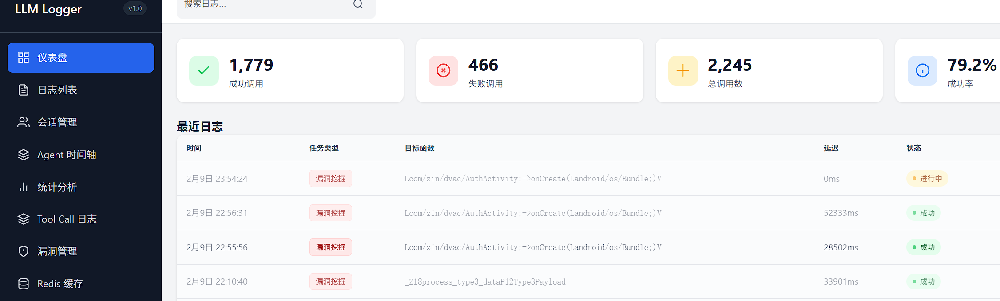
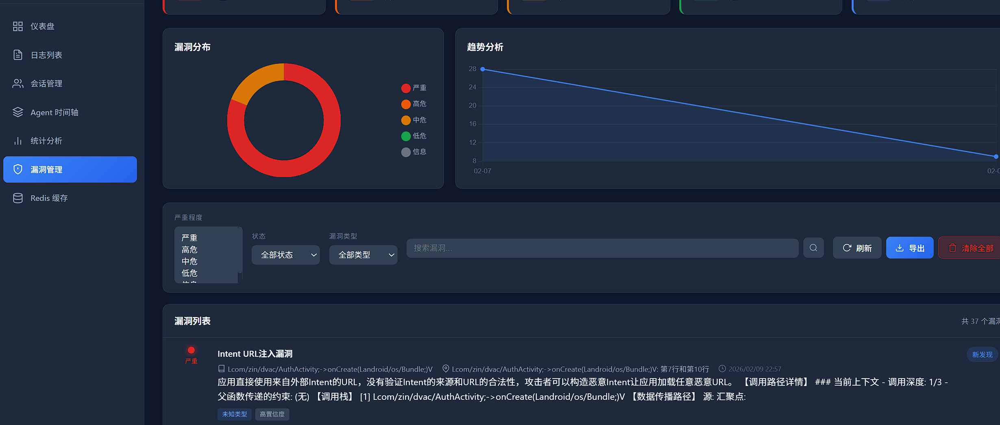

# IVAgent - 智能漏洞分析系统

[](https://www.python.org/downloads/)
[](LICENSE)

IVAgent (Intelligent Vulnerability Analysis Agent) 是一个基于大语言模型的异步智能程序分析框架，专注于二进制和源代码的深度漏洞挖掘。

## ✨ 核心特性

- **🔍 多引擎支持**：统一接口支持 IDA Pro (二进制)、JEB (Android APK)、ABC Decompiler (HarmonyOS) 和源代码分析
- **🤖 AI 驱动**：基于 LangGraph 和 Tool Call 机制的深度漏洞检测
- **⚡ 高并发架构**：异步协程设计，支持大规模函数并行分析
- **📋 前置条件配置**：使用 Markdown 定义分析约束，降低 LLM 使用门槛
- **🌐 可视化日志**：内置 Web 界面实时查看 LLM 交互过程
- **🔒 约束传播**：支持函数调用链中的参数约束传递

## 🚀 快速开始

### 环境要求

- Python 3.10+
- OpenAI API Key 或兼容的 LLM 服务

### 安装

```bash
# 克隆仓库
git clone <repository-url>
cd ivas

# 安装依赖
pip install -r requirements.txt
```

### 基础使用

#### 1. 分析单个函数

```bash
python ivagent_scan.py \
    --engine ida \
    --target /path/to/binary.idb \
    --function "0x140001000" \
    --preset binary \
    --api-key $OPENAI_API_KEY \
    --model gpt-4
```

#### 2. 批量分析多个函数

```bash
python ivagent_scan.py \
    --engine ida \
    --target /path/to/binary.idb \
    --function "0x140001000" "0x140001100" "0x140001200" \
    --preset binary \
    --concurrency 5 \
    --api-key $OPENAI_API_KEY
```

#### 3. 使用自定义配置

```bash
python ivagent_scan.py \
    --engine jeb \
    --target /path/to/app.apk \
    --function "Lcom/example/MainActivity;->onCreate" \
    --config /path/to/custom_precondition.md \
    --api-key $OPENAI_API_KEY
```

### 启动日志可视化服务

```bash
# 使用快速启动脚本
python launch_logger.py

# 或使用参数
python launch_logger.py --port 8080 --host 0.0.0.0
```

访问 `http://localhost:8080` 查看 LLM 交互日志。

### 界面预览

**LLM 交互日志查看**



实时追踪每一次 LLM 调用，包括完整的 Prompt、Response、耗时统计。

**漏洞分析结果**



可视化展示发现的漏洞，支持按严重程度、置信度筛选。

## 📁 项目结构

```
ivas/
├── ivagent/                    # 核心框架代码
│   ├── agents/                 # Agent 层
│   │   ├── base.py            # Agent 基类
│   │   ├── deep_vuln_agent.py # 深度漏洞挖掘 Agent
│   │   ├── callsite_agent.py  # 调用点分析 Agent
│   │   ├── function_summary_agent.py  # 函数摘要 Agent
│   │   └── prompts.py         # 提示词模板
│   ├── engines/               # 引擎层
│   │   ├── base_static_analysis_engine.py  # 引擎基类
│   │   ├── ida_engine.py      # IDA Pro 引擎
│   │   ├── jeb_engine.py      # JEB 引擎
│   │   ├── abc_engine.py      # ABC Decompiler 引擎
│   │   ├── source_code_engine.py  # 源码分析引擎
│   │   └── factory.py         # 引擎工厂
│   ├── models/                # 数据模型层
│   │   ├── vulnerability.py   # 漏洞模型
│   │   ├── constraints.py     # 约束/前置条件模型
│   │   ├── function.py        # 函数模型
│   │   └── callsite.py        # 调用点模型
│   ├── core/                  # 核心工具层
│   │   ├── tool_llm_client.py # Tool Call LLM 客户端
│   │   ├── llm_logger.py      # LLM 日志管理
│   │   ├── agent_logger.py    # Agent 执行日志
│   │   └── vuln_storage.py    # 漏洞存储管理
│   └── web/                   # Web 可视化服务
│       ├── api.py             # FastAPI 接口
│       ├── server.py          # 服务器启动脚本
│       └── static/            # 前端资源
├── preconditions/             # 预置分析配置
│   ├── android.md            # Android 分析配置
│   ├── harmony.md            # HarmonyOS 分析配置
│   ├── binary.md             # 二进制分析配置
│   └── _template.md          # 配置模板
├── ivagent_scan.py           # 主扫描脚本
├── launch_logger.py          # 日志服务启动器
└── start_ida_rpc.py         # IDA RPC 服务启动器
```

## 🔧 架构设计

### 系统架构

```
┌─────────────────────────────────────────────────────────────────┐
│                         IVAgent 架构                            │
├─────────────────────────────────────────────────────────────────┤
│  ┌─────────────┐  ┌─────────────┐  ┌─────────────┐             │
│  │   CLI 层    │  │   Web 层    │  │   API 层    │             │
│  │ ivagent_scan│  │  日志可视化 │  │  REST API   │             │
│  └──────┬──────┘  └──────┬──────┘  └──────┬──────┘             │
│         └─────────────────┼─────────────────┘                  │
│                           ▼                                     │
│  ┌─────────────────────────────────────────────────────────┐   │
│  │                    Agent 层                              │   │
│  │  ┌──────────────┐  ┌──────────────┐  ┌──────────────┐   │   │
│  │  │DeepVulnAgent │  │CallsiteAgent │  │FunctionSummary│   │   │
│  │  └──────────────┘  └──────────────┘  └──────────────┘   │   │
│  └─────────────────────────┬───────────────────────────────┘   │
│                            ▼                                   │
│  ┌─────────────────────────────────────────────────────────┐   │
│  │                  Engine 层 (异步)                        │   │
│  │  ┌─────────┐  ┌─────────┐  ┌─────────┐  ┌─────────┐    │   │
│  │  │ IDA     │  │ JEB     │  │ ABC     │  │ Source  │    │   │
│  │  │ Engine  │  │ Engine  │  │ Engine  │  │ Engine  │    │   │
│  │  └─────────┘  └─────────┘  └─────────┘  └─────────┘    │   │
│  └─────────────────────────────────────────────────────────┘   │
└─────────────────────────────────────────────────────────────────┘
```

### 核心组件说明

| 组件 | 职责 | 关键文件 |
|------|------|----------|
| **Agent 层** | 实现 AI 驱动的分析逻辑 | `agents/deep_vuln_agent.py` |
| **Engine 层** | 封装反编译/分析工具接口 | `engines/` |
| **Model 层** | 定义核心数据结构 | `models/` |
| **Core 层** | 提供通用工具和服务 | `core/` |
| **Preconditions** | 分析约束配置 | `preconditions/` |

## 📝 前置条件配置

前置条件使用 Markdown 格式定义，帮助 Agent 理解目标函数的上下文：

```markdown
---
name: Binary Parser Function
description: 二进制解析函数的安全分析配置
target: binary_parser
version: "1.0"
author: security_team
taint_sources: ["param1", "param2"]
---

## 参数说明

### 第一个参数
- 指向攻击者控制的数据缓冲区

### 第二个参数  
- 数据长度（可能由攻击者指定）

## 安全检查清单

- [ ] 是否验证长度参数的合理性？
- [ ] 内存拷贝操作是否安全？
```

## 🔌 支持的引擎

| 引擎 | 目标类型 | 默认端口 | 状态 |
|------|----------|----------|------|
| IDA | 二进制 (PE/ELF/Mach-O) | 9999 | ✅ 已支持 |
| JEB | Android APK/DEX | 16161 | ✅ 已支持 |
| ABC | HarmonyOS 应用 | 8651 | ✅ 已支持 |
| Source | 源代码 | - | ✅ 已支持 |

## 🛠️ 开发指南

### 创建自定义 Agent

```python
from ivagent.agents.base import BaseAgent

class MyCustomAgent(BaseAgent):
    async def run(self, **kwargs) -> Dict[str, Any]:
        # 实现分析逻辑
        function_code = await self.engine.get_function_def(
            function_signature=kwargs['signature']
        )
        # ...
        return {"vulnerabilities": []}
```

### 添加新引擎

```python
from ivagent.engines.base_static_analysis_engine import BaseStaticAnalysisEngine

class MyEngine(BaseStaticAnalysisEngine):
    async def get_function_def(self, function_signature=None, **kwargs):
        # 实现获取函数定义
        pass
    
    async def get_callee(self, function_signature):
        # 实现获取被调用者
        pass
```

## 📊 漏洞模型

```python
@dataclass
class Vulnerability:
    type: VulnerabilityType      # 漏洞类型
    name: str                    # 漏洞名称
    description: str             # 详细描述
    location: str                # 位置信息
    severity: float             # 严重程度 (0-1)
    confidence: float           # 置信度 (0-1)
    data_flow: DataFlowPath     # 数据流路径
    remediation: str            # 修复建议
```

支持的漏洞类型：
- 缓冲区溢出 (Buffer Overflow)
- 数组越界 (Array OOB)
- 任意地址读写 (Arbitrary RW)
- 格式化字符串 (Format String)
- 整数溢出 (Integer Overflow)
- UAF (Use After Free)
- 命令注入 (Command Injection)
- SQL 注入 (SQL Injection)

## 📈 日志与监控

系统提供完整的 LLM 交互日志记录：

- **请求/响应追踪**：完整的 Prompt 和 LLM 输出
- **Agent 执行追踪**：Agent 调用链和执行时间
- **漏洞管理**：漏洞发现、验证、修复状态追踪
- **实时 WebSocket**：日志实时推送到前端

## 🤝 贡献指南

欢迎提交 Issue 和 PR！

1. Fork 仓库
2. 创建特性分支 (`git checkout -b feature/AmazingFeature`)
3. 提交更改 (`git commit -m 'Add some AmazingFeature'`)
4. 推送到分支 (`git push origin feature/AmazingFeature`)
5. 创建 Pull Request


---

**免责声明**: 本工具仅用于合法的安全研究和漏洞分析，使用者需遵守相关法律法规。
