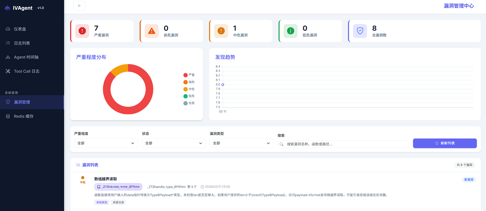

# IVAgent

IVAgent 是一个基于 LLM 的漏洞挖掘系统，支持多种静态分析引擎，并提供一套基于 Markdown 和 LLM 语义评估的测评框架。



## 核心能力

- 多引擎分析：`source` / `ida` / `jeb` / `abc`
- Skill 驱动分析：统一用 `SKILL.md` 描述分析目标、污点源、危险 API 和关注点
- 多 Agent 协作：`DeepVulnAgent`、`CodeExplorerAgent`、`TaskExecutorAgent` 等
- LLM 驱动测评：测试用例、检测结果、评测报告全部走 Markdown
- 文本化运行产物：除了 sqlite，运行结果还会导出便于阅读的 Markdown 文档

## 项目结构

```text
IVAgent/
├── ivagent/                  # 核心实现
├── vuln_skills/              # 漏洞挖掘 Skill（分析模式和工作流）
├── coding_skills/            # 开发辅助 Skill（供 coding agent 使用）
├── tests/eval/               # 测评框架
├── tests/testcases/          # 测试用例
├── ivagent_cli.py            # 主 CLI
├── launch_web.py             # Web UI 启动入口
└── plans/                    # 方案文档
```

## 环境要求

- Python 3.12+
- Redis
- 可用的 LLM OpenAI 兼容接口

如果你使用 `source` 引擎，只需要 Python、Redis 和 LLM 配置。  
如果你使用 `ida` / `jeb` / `abc`，还需要对应后端服务或工具环境。

## 安装

推荐使用项目内虚拟环境：

```bash
python3 -m venv .venv
.venv/bin/python -m pip install -r requirements.txt
```

## 环境变量

最少需要配置：

```bash
export OPENAI_API_KEY="your-api-key"
export OPENAI_BASE_URL="http://host:port/v1"
export OPENAI_MODEL="gpt-5.2"
```

例如：

```bash
OPENAI_API_KEY='your-api-key-1' \
OPENAI_BASE_URL='http://192.168.72.1:8317/v1' \
OPENAI_MODEL='gpt-5.2'
```

## Redis

运行分析和测评前，需要先启动 Redis。

例如：

```bash
redis-server
```

如果 Redis 没启动，扫描阶段会直接失败。

## 执行方式

### 1. 主分析 CLI

统一入口是 [ivagent_cli.py](/home/hac425/IVAgent/ivagent_cli.py)。

查看帮助：

```bash
.venv/bin/python ivagent_cli.py --help
```

### 2. 直接函数扫描

适合对指定函数做深度漏洞分析。

源码分析示例：

```bash
.venv/bin/python ivagent_cli.py \
  --skill eval_source_scan \
  --engine source \
  --target tests/testcases/heap_overflow_01/source \
  --source-root tests/testcases/heap_overflow_01/source \
  --function parse_packet
```

IDA 示例：

```bash
.venv/bin/python ivagent_cli.py \
  --skill binary_parser \
  --engine ida \
  --target /path/to/binary.i64 \
  --function sub_140001000
```

JEB 示例：

```bash
.venv/bin/python ivagent_cli.py \
  --skill android_entry \
  --engine jeb \
  --target /path/to/app.apk \
  --function "Lcom/example/LoginActivity;->checkLogin"
```

ABC 示例：

```bash
.venv/bin/python ivagent_cli.py \
  --skill harmony_entry \
  --engine abc \
  --target /path/to/app.abc \
  --function "com.example.EntryAbility.onCreate"
```

### 3. Skill 编排执行

适合让 LLM 按 Skill 描述自主规划和执行分析。

```bash
.venv/bin/python ivagent_cli.py \
  --skill android_sql_injection \
  --engine source \
  --target /path/to/source \
  --source-root /path/to/source
```

## Web 使用方式

启动 Web：

```bash
.venv/bin/python launch_web.py
```

默认访问：

```text
http://localhost:8080
```

Web 界面可用于查看：

- LLM 日志
- Agent 执行树
- 漏洞列表
- 运行状态

## 测试与评估

测试和评估的完整工作流请参考：[coding_skills/test_and_eval/SKILL.md](coding_skills/test_and_eval/SKILL.md)

快速入口：

```bash
.venv/bin/python -m tests.eval.cli --help
```

## Skill 使用

Skill 统一由 [skill_parser.py](/home/hac425/IVAgent/ivagent/models/skill_parser.py) 解析。

示例：

```bash
.venv/bin/python - <<'PY'
from ivagent.models.skill_parser import SkillParser
skill = SkillParser().resolve_skill('eval_source_scan', skills_root='vuln_skills')
print(skill.name)
print(skill.engine)
PY
```

当前评测专用 skill：

- [vuln_skills/eval_source_scan/SKILL.md](/home/hac425/IVAgent/vuln_skills/eval_source_scan/SKILL.md)

## 说明

- 当前项目按新方案开发，不做旧方案兼容层
- 当前测评链路优先使用 Markdown 文档而不是中间 JSON
- sqlite 仍然保留，用于程序内部统计、查询和导出
- 对用户查看而言，优先看导出的 Markdown 文件即可
